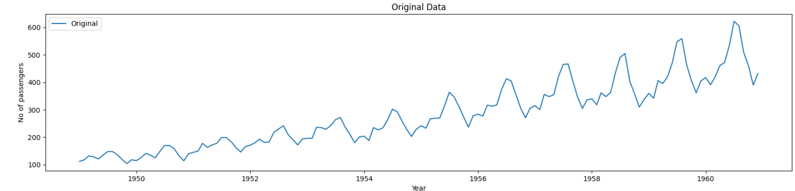
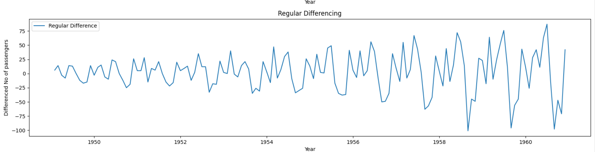
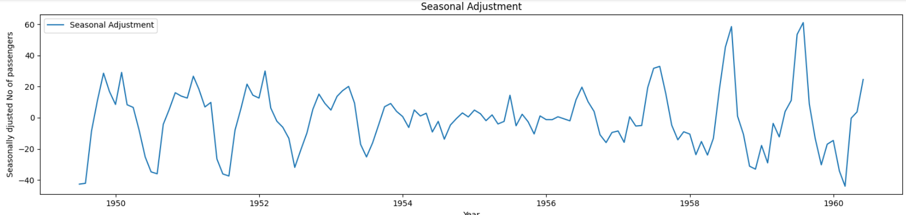
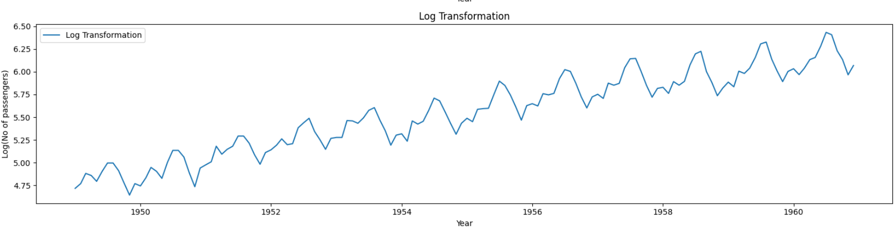
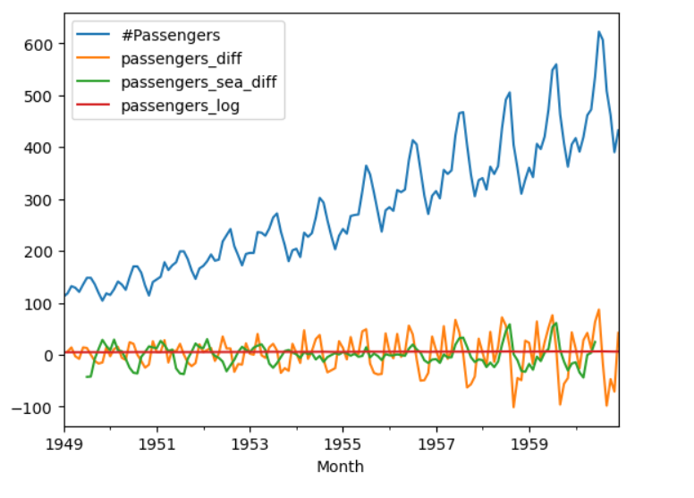

## Devloped by: Sreevalsan V
## Register Number: 212223240158
##  Date: 2-03-2025

# Ex.No: 1B                CONVERSION OF NON STATIONARY TO STATIONARY DATA


# AIM:
To perform regular differncing,seasonal adjustment and log transformatio on international airline passenger data


# ALGORITHM:
1. Import the required packages like pandas and numpy
2. Read the data using the pandas
3. Perform the data preprocessing if needed and apply regular differncing,seasonal adjustment,log transformation.
4. Plot the data according to need, before and after regular differncing,seasonal adjustment,log transformation.
5. Display the overall results.

# PROGRAM:
```py
import pandas as pd
import numpy as np
import matplotlib.pyplot as plt

from statsmodels.tsa.seasonal import seasonal_decompose

data=pd.read_csv('/content/AirPassengers.csv')

data.head()

data['Month']=pd.to_datetime(data['Month']) #data=pd.read_csv("/content/AirPassengers.csv",parse_dates=['Month'],index_col='Month')

data.set_index('Month',inplace=True)

data['passengers_diff']=data['#Passengers']-data['#Passengers'].shift(1)

result = seasonal_decompose(data['#Passengers'], model='additive', period=12)
data['passengers_sea_diff']=result.resid

data['passengers_log'] = np.log(data['#Passengers'])

plt.figure(figsize=(16, 16))

plt.subplot(4, 1, 1)
plt.plot(data['#Passengers'], label='Original')
plt.legend(loc='best')
plt.title('Original Data')
plt.xlabel('Year')
plt.ylabel('No of passengers')

plt.subplot(4, 1, 2)
plt.plot(data['passengers_diff'], label='Regular Difference')
plt.legend(loc='best')
plt.title('Regular Differencing')
plt.xlabel('Year')
plt.ylabel('Differenced No of passengers')

plt.subplot(4, 1, 3)
plt.plot(data['passengers_sea_diff'], label='Seasonal Adjustment')
plt.legend(loc='best')
plt.title('Seasonal Adjustment')
plt.xlabel('Year')
plt.ylabel('Seasonally djusted No of passengers')

plt.subplot(4, 1, 4)
plt.plot(data['passengers_log'], label='Log Transformation')
plt.legend(loc='best')
plt.title('Log Transformation')
plt.xlabel('Year')
plt.ylabel('Log(No of passengers)')

plt.tight_layout()
plt.show()

data.plot(kind='line')
```


# OUTPUT:
Unprocessed Data:



After regular differencing:




After seasonal adjustment:



After log transformation:



Overall view:




# RESULT:

Thus we have created the python code for the conversion of non stationary to stationary data on international airline passenger data.